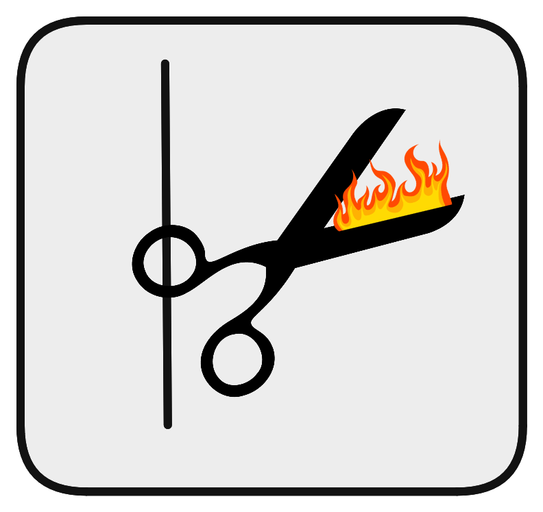

  
   
  <strong style="display: block; margin-top: 10px;">CLEAN EDIT</strong>

## TODO
- SelectedProject has null tracks.
- Rest upload video
- Fix editor

## API BACKEND (OUTDATED)
Actually we can turn the packages we need to assembly and execute in the user side => A more complex API is left for the future. There is a start of it but for simplicity we are taking a more approach like the [excalidraw](https://excalidraw.com/) where we save the data in the browser and output the saved projects as files. 
What is the necessary for the API we have URL to videos because we cant just load absolute paths from the user machines.